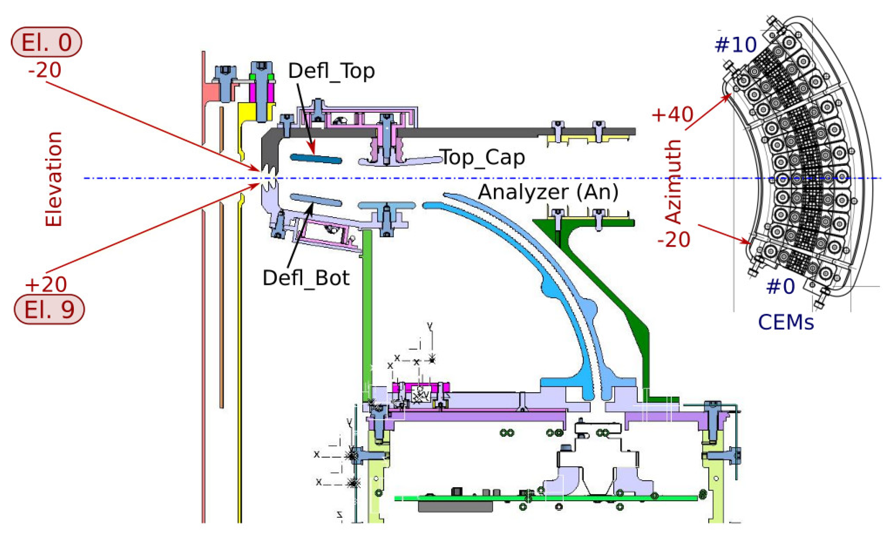
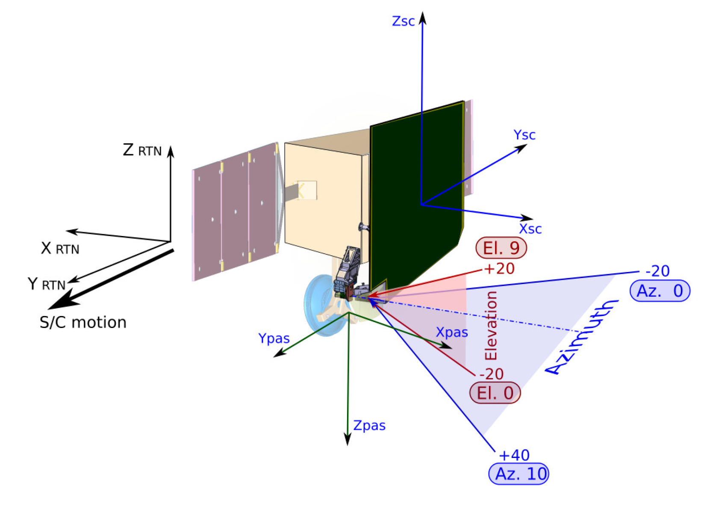
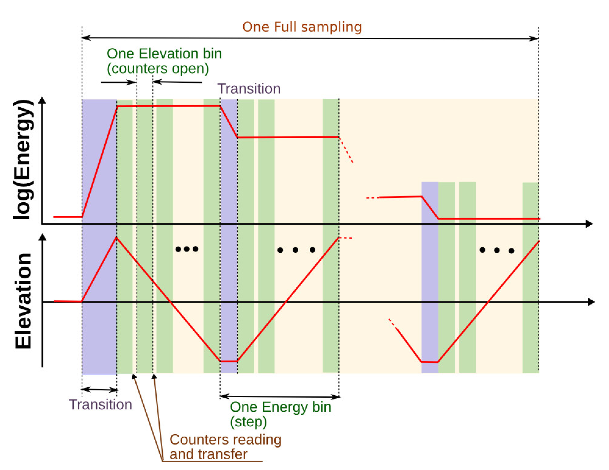
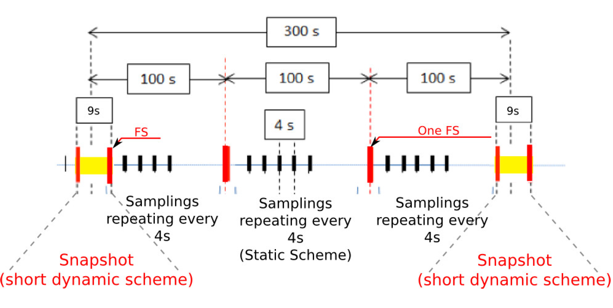

PAS frames and samplings
------------------------

In this section, we describe the PAS frames for observations and sampling modes. 

**Short-hands for parameters**

+---------------+---------------------------------+
| Parameters    | Description                     |
+===============+=================================+
| K             | Number of samplings per second  |
+---------------+---------------------------------+
| NE            | Number of energy bins           |
+---------------+---------------------------------+
| SE            | Start Energy bin                |
+---------------+---------------------------------+
| NEL           | Number of ELevation bins        |
+---------------+---------------------------------+
| SEL           | Start ELevation bin             |
+---------------+---------------------------------+

Frames and bins location
========================

Figure 1 shows a simplified diagram of a side-cut of PAS, showing the **Elevation** and **Azimuth** angles. Table 1 summarizes the angle coverage, total bin number, and bin labels from the diagram.

*Table 1 Summary of spatial sampling coverage*

+-------------+---------------------------+------------------+----------------+
| Parameters  | Angle coverage (deg)      | Total bin number |   Bin labels   |
+=============+===========================+==================+================+
| Elevation   | [-22.5, 22.5]             |      9           | El.0 to El.9   |
+-------------+---------------------------+------------------+----------------+
| Azimuth     | [-24, 42]                 |     11           | CEM 0 to CEM 10|
+-------------+---------------------------+------------------+----------------+

In the diagram, the angle coverage does not include the periphery.

   *Figure 1 Elevation and azimuth bins and angles in the PAS analyzer frame. The CEMs plane is shown from the Analyzer.*

Additionally, PAS is capable of varying the voltage in order to detect ions in energy range as shown in Table 2.

*Table 2 Summary of the energy coverage and bins*

+-------------+-----------------+------------------+
| Parameters  | Energy coverage | Total bin number |
+=============+=================+==================+
| Energy      | [200, 20000] eV |         96       |
+-------------+-----------------+------------------+

Transformation between Solar Orbiter and PAS frames
+++++++++++++++++++++++++++++++++++++++++++++++++++

Figure 2 shows the same in the SRF (noted as SC in Figure and equations below). Note that the solar orbiter frame corresponds to the RTN Heliocentric frame most of the time with

.. math::
   X_{RTN} &= -X_{SC},\\
   Y_{RTN} &=-Y_{SC}.

   *Figure 2 Elevation and azimuth bins in the Solar Orbiter frame.*

Thus the ion velocity unit vector corresponding to the given bin is calculated as follows:
For the PAS frame:

.. math::
   V_X^{PAS} &= - \cos(El) \cdot \cos (Az),\\
   V_Y^{PAS} &= - \cos(El) \cdot \sin (Az),\\
   V_Z^{PAS} &= \sin(El).

For the Solar Orbiter (SRF) frame:

.. math::
   V_X^{SRF} &= - \cos(El) \cdot \cos (Az),\\
   V_Y^{SRF} &= \cos(El) \cdot \sin (Az),\\
   V_Z^{SRF} &= - \sin(El).

PAS sampling organization
=========================

PAS performs the energy-elevation sweep as shown in Figure 3. PAS keeps the constant energy while sweeping through the elevations. During the sweeping along one elevation bin, PAS accumulates counts in all 11 azimuth bins simultaneously. As soon as the energy-elevation sweep is completed the resulting data set (so-called “sampling”) is a matrix of [11 azimuth, 9 elevations, 96 energies]. Because in most of the cases the real sweep does not cover the full energy-elevation range (it may be like [11 azimuths, 3:7 elevations, 10:73 energies]), we provide also the supporting information about the start/number of the energy and the elevation bins. Since a “peak tracking” runs permanently, the position of the energy x elevation window inside the 9 x 96 frame can change at any time.

   *Figure 3 PAS measurements scheme.*

PAS operation cyclogram
+++++++++++++++++++++++

In the normal mode, the PAS cyclogram is following the cycle shown in Figure 4. PAS produces one sampling per 4 s. Every 100 s, PAS tries to adapt the energy/elevation window to the solar wind velocity vector. Each 300s, PAS performs fast measurements called “SnapShot”. Here PAS provides “K” number of samplings per second without any gaps. This short cadence takes 9 s. The long fast measurements, called “Burst Mode” is performed by the ground TC. The duration of the “Burst Mode” is 300s.

   *Figure 4 PAS Normal mode implementation*

